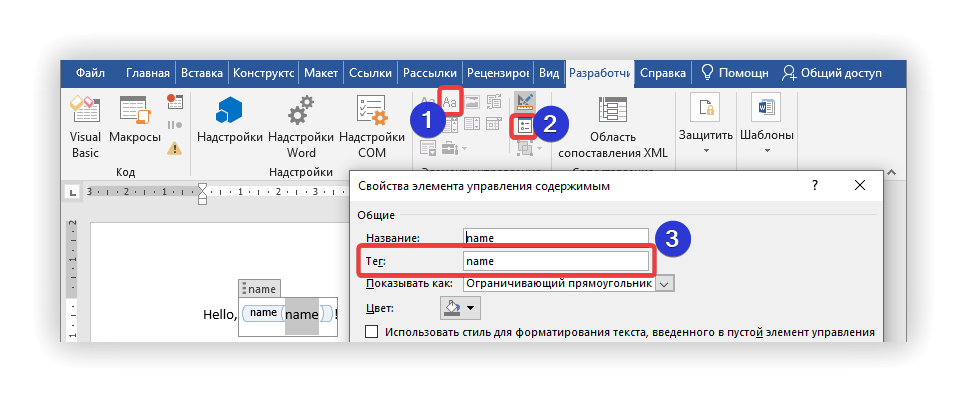
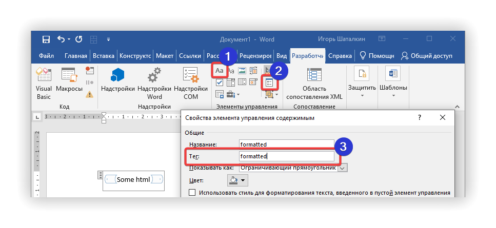
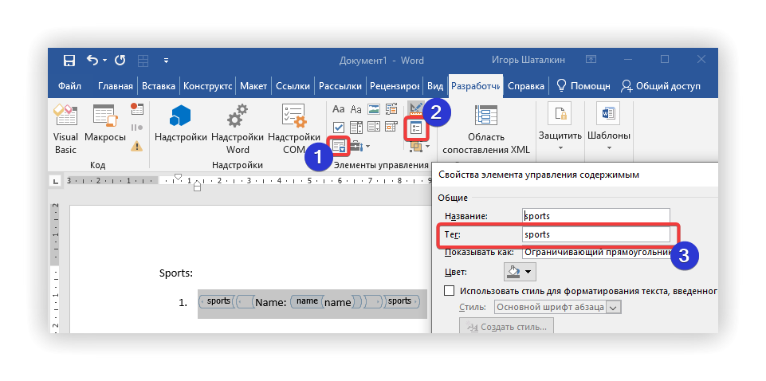

[](https://www.nuget.org/packages/CUSTIS.Generator.Docx)

# CUSTIS.Generator.Docx 
Generates docx document from docx template using data in JSON-format. This is a port from [novodocx](https://github.com/rezanid/novodocx) with some improvements.

# Getting started

1. Install `CUSTIS.Generator.Docx` [package](https://www.nuget.org/packages/CUSTIS.Generator.Docx)
2. Prepare docx-template (see [instructions](#how-to-create-template) below)
3. Populate template with your data:

```csharp
var jsonData = "{'someData': 'hello'}"; // data to populate template with
var templateFile = "template.docx"; // file with template 

// populate file with data
var docProcessor = new WordDocumentProcessor(NullLogger<WordDocumentProcessor>.Instance);
using var filled = await docProcessor.PopulateDocumentTemplate(templateFile, jsonData);

// save file
await using var resultFileStream = new FileStream("destination.docx", FileMode.OpenOrCreate, FileAccess.Write);
await filled.CopyToAsync(resultFileStream);
```

# How to create template

Open Developer Tab in MS Word and enter Design Mode ([instructions](https://www.namicsoft.com/doc/enter-design-mode-microsoft-word/)).

## Simple text



1. Use `Plain Text Content Control` if you need to render text without line breaks
2. Open `Properties`
3. Fill `Tag` with the field name from JSON

Data sample:
```csharp
var jsonData = @"{'name': 'CUSTIS.Generator.Docx'}";
```

Output: `Hello, CUSTIS.Generator.Docx!`

## HTML



1. Use `Rich Text Content Control` if you need to render HTML
2. Open `Properties`
3. Fill `Tag` with the field name from JSON

Limitations: only `<p>`, `<br>`, `<ol>`, `<ul>`, `<li>` tags are processed. All other tags are skipped.

Data sample:
```csharp
var jsonData = @"{'formatted': 'Hello,<br/>CUSTIS.<red>Generator</red>.Docx!'}";
```

Output: 
```
Hello,
CUSTIS.Generator.Docx!
```

## Repeated data (arrays)



1. Use `Repeated Section Control` if you need to render array
2. Open `Properties`
3. Fill `Tag` with the name of array from JSON
4. Use either `Plain` or `Rich Text Content Controls` inside `Repeated Section Control` to render text 

Arrays can be rendered as paragraphs, lists or even tables. You can render nested arrays too (with any number of nested lists).

Data sample:
```csharp
var jsonData = @"{'sports': [{'name': 'swimming'}, {'name': 'football'}]}";
```

Output:
```
Sports:
1. Name: swimming
2. Name: football
```

## Visibility conditions

You can manage visibility of content using conditional expressions.

1. Wrap the content into `Plain` or `Rich Text Content Control`
2. Open `Properties`
3. Fill `Tag` with `visible: expression` (e.g. `visible: myField == 'git'`)

You can use other content controls inside visibility control.

Supported expressions:
* `operand`, `!operand`;
* `op1 == op2`, `op1 != op2`;
* only for ints: `op1 < op2`, `op1 > op2`, `op1 <= op2`, `op1 >= op2`.

Examples of expressions with their result (including `!null`, `null == null`, etc.) could be found in [ExpressionEvaluatorTests](src/Tests/CUSTIS.Generator.Docx.Tests/ExpressionEvaluatorTests.cs#9).

# Advanced features

[Json Path expressions](https://goessner.net/articles/JsonPath) can be used to query data (use it as `Tag` in Word content control). `CUSTIS.Generator.Docx` uses `Json.NET` (from Newtonsoft). You can get some samples of JSON path [here](https://www.newtonsoft.com/json/help/html/QueryJsonSelectToken.htm). 

# Limitations

MS Word doesn't allow to repeat columns. The workaround is to create multiple tables (with 1, 2, ... columns) and to wrap each table in [visibility expression](#visibility-conditions). 

# Release

1. Change version in `Directory.Build.props`
2. Use internal CUSTIS git to push to nuget 

# Links

* [Some info about creating Word templates](https://support.clio.com/hc/en-us/articles/203359420-Tutorial-Creating-a-Protected-Fillable-Template-in-Microsoft-Word-for-Use-in-Document-Automation)